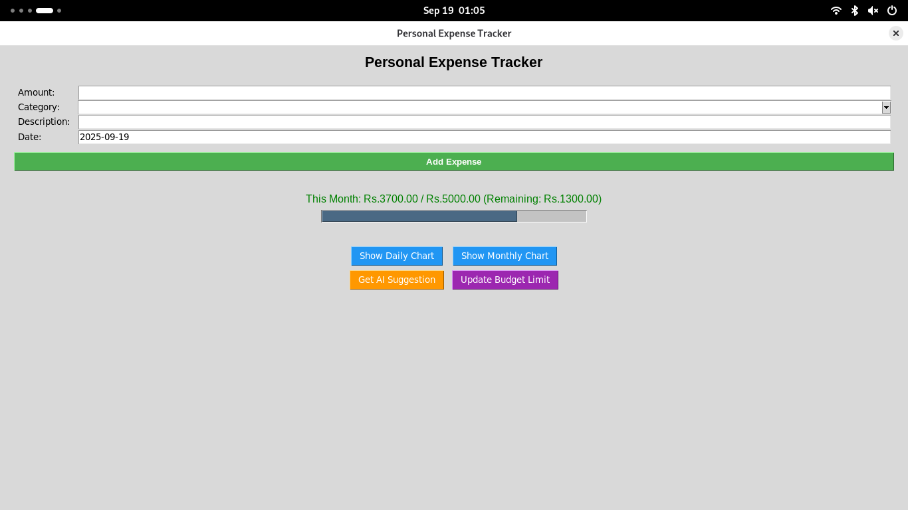

# Personal Expense Tracker

A feature-rich desktop application built with Python and Tkinter for tracking personal expenses with AI-powered insights using Google's Gemini API.


## Features

### 💰 Expense Management
- Add expenses with date, category, amount, and description
- Predefined categories: Food, Travel, Shopping, Entertainment, Bills, Healthcare, Other
- Automatic data persistence using text files
- Date validation and input sanitization

### 📊 Budget Tracking
- Set and update monthly budget limits
- Real-time budget progress visualization
- Color-coded budget status (green/orange/red)
- Current month spending calculation

### 📈 Data Visualization
- **Daily Charts**: Bar charts showing daily expenses for the current month
- **Monthly Charts**: Bar charts displaying monthly expense trends over time
- Interactive matplotlib integration

### 🤖 AI-Powered Insights
- Integration with Google's Gemini 1.5 Flash API
- Personalized spending analysis and recommendations
- Pattern recognition in spending habits
- Actionable financial advice based on your data

### 🎨 User Interface
- Clean and intuitive Tkinter-based GUI
- Responsive layout with proper field validation
- Progress bars for budget tracking
- Popup windows for AI suggestions and charts

## Installation

### Prerequisites
- Python 3.7 or higher
- pip package manager

### Required Dependencies
```bash
pip install matplotlib requests
```

### Setup Instructions

1. **Clone the repository:**
```bash
git clone https://github.com/AryaXDG/expense-tracker.git
cd personal-expense-tracker
```

2. **Install dependencies:**
```bash
pip install -r requirements.txt
```

3. **Set up your Gemini API key:**
   - Run the application once to generate the `.env` file
   - Get your API key from [Google AI Studio](https://makersuite.google.com/app/apikey)
   - Open the `.env` file and replace `your_gemini_api_key_here` with your actual API key:
   ```
   GEMINI_API_KEY=your_actual_api_key_here
   ```

4. **Run the application:**
```bash
python main.py
```

## Usage

### First Time Setup
1. On first launch, you'll be prompted to set your monthly budget limit
2. The application will create necessary configuration files automatically

### Adding Expenses
1. Enter the amount in the "Amount" field
2. Select a category from the dropdown menu
3. Add an optional description
4. Verify the date (defaults to today)
5. Click "Add Expense"

### Viewing Reports
- **Daily Chart**: Shows expenses for each day of the current month
- **Monthly Chart**: Displays total expenses for each month
- **AI Suggestions**: Get personalized financial advice based on your spending patterns

### Managing Budget
- View current month spending vs budget in the main interface
- Update your monthly budget limit using the "Update Budget Limit" button
- Monitor progress with the visual progress bar

## File Structure

```
personal-expense-tracker/
│
├── main.py              # Main application file
├── data.txt             # Expense data storage (auto-generated)
├── config.txt           # Configuration settings (auto-generated)
├── .env                 # Environment variables (auto-generated)
├── requirements.txt     # Python dependencies
└── README.md           # This file
```

## Data Storage

The application uses simple text files for data persistence:

- **data.txt**: Stores expense records in pipe-delimited format
- **config.txt**: Stores monthly budget limit
- **.env**: Contains API keys and environment variables

## API Integration

### Gemini API Features
- Real-time spending analysis
- Pattern recognition in financial habits
- Personalized budget recommendations
- Actionable tips for financial management

### API Configuration
The application automatically handles:
- Request formatting for Gemini 1.5 Flash API
- Error handling and timeout management
- Response parsing and display

## Screenshots

### Main Application Interface

*The main dashboard showing expense entry form, budget tracking, and action buttons*


### Daily Expense Chart

*displaying daily expenses for the current month*

### Monthly Expense Overview

*Monthly expense trends over time for better financial planning*

### AI-Powered Suggestions

*Personalized financial advice and spending analysis from Gemini AI*

> **Note**: To view the application in action, clone the repository and run `python main.py`

